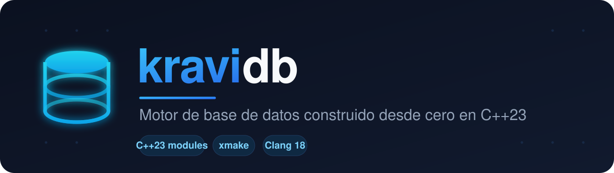
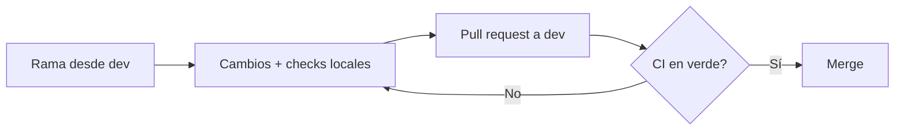

<div align="center">
  

  <br><br>

  <a href="https://en.cppreference.com/w/cpp/23"></a>
  <a href="https://xmake.io"></a>
  <a href="https://clang.llvm.org/"></a>
  <a href="https://github.com/CHOCEK-RB/kravidb/actions/workflows/ci.yml"></a>
  

  <br><br>

  <p><i>Un motor de base de datos desarrollado desde cero para el curso de Estructuras de Datos y Algoritmos.</i></p>

  <a href="#-sobre-el-proyecto">Sobre el proyecto</a> &nbsp;•&nbsp;
  <a href="#-inicio-rápido">Inicio rápido</a> &nbsp;•&nbsp;
  <a href="#-estructura">Estructura</a> &nbsp;•&nbsp;
  <a href="#-calidad-de-código">Calidad de código</a> &nbsp;•&nbsp;
  <a href="#-flujo-de-trabajo">Flujo de trabajo</a>
</div>

<br>

---

## 📖 Sobre el proyecto

**kravidb** es un motor de base de datos que se construye paso a paso, implementando desde adentro los componentes de una base de datos real: el **motor de almacenamiento**, el manejo de **páginas** en disco, la **indexación** y la ejecución de **consultas**.

El proyecto aprovecha lo más moderno de **C++23** —incluyendo **módulos** y la librería estándar importada con `import std;`— para lograr un código limpio, de compilación rápida y fácil de mantener.

<br>

## ✨ Características

<table>
  <tr>
    <td width="50%" valign="top">

  🧩 **Arquitectura modular**
  Basada en módulos de C++23 (`.cppm`), sin cabeceras heredadas.

  💾 **Motor de almacenamiento**
  El primer bloque de construcción de la base de datos.

  ⚡ **Compilación moderna**
  Con [xmake](https://xmake.io): sin `Makefile` ni `CMake`.

   </td>
    <td width="50%" valign="top">

  🛡️ **Seguridad de memoria**
  AddressSanitizer y UBSan activos en modo debug.

  🎯 **Calidad garantizada**
  `clang-format`, `clang-tidy` y CI automático en cada commit.

  🔍 **Cero descuidos**
  Los *warnings* se tratan como errores.

   </td>
  </tr>
</table>

<br>

## 🛠️ Stack tecnológico

| Herramienta | Versión | Propósito |
|:---|:---:|:---|
| **C++** | `23` | Lenguaje principal — módulos y `std` importado |
| **Clang** | `17+ / 18` | Compilador |
| **xmake** | `2.8+` | Sistema de construcción |
| **clang-format** | `17+` | Formateo automático del código |
| **clang-tidy** | `17+` | Análisis estático |
| **libc++** | `18` | Librería estándar de LLVM |

<br>

## 🚀 Inicio rápido

> [!NOTE]
> Necesitas **clang++ 17+**, **xmake 2.8+**, **clang-format 17+** y **clang-tidy 17+** instalados.

```bash
# Clonar el repositorio
git clone https://github.com/CHOCEK-RB/kravidb.git
cd kravidb

# Compilar el proyecto
xmake

# Ejecutar el binario
xmake run kravidb
```

<div align="center">

**Salida esperada**

</div>

```console
Booting: Starting kravidb storage engine v0.1.0
```

<br>

## 📂 Estructura

```
kravidb/
├── src/
│   ├── main.cpp              # Punto de entrada
│   └── storage/
│       └── engine.cppm       # Módulo del motor de almacenamiento
├── tests/                    # Pruebas (en construcción)
├── .github/workflows/
│   └── ci.yml                # Pipeline de integración continua
├── .githooks/
│   └── pre-commit            # Validación antes de cada commit
├── .clang-format             # Reglas de formateo
├── .clang-tidy               # Reglas de análisis estático
├── xmake.lua                 # Configuración de construcción
└── README.md
```

<br>

## ✅ Calidad de código

Todos los *pull requests* pasan por **GitHub Actions** (`.github/workflows/ci.yml`). Cada commit debe superar las verificaciones de **formato** y **compilación** antes de poder fusionarse.

> [!TIP]
> Activa el hook local **una sola vez** y cada `git commit` validará formato, compilación y análisis estático de forma automática:
> ```bash
> git config core.hooksPath .githooks
> ```

<details>
<summary><b>🔧 Verificaciones manuales</b> — los mismos comandos que corre la CI</summary>

<br>

```bash
# 1. Formatear todos los archivos fuente automáticamente
find src tests -name "*.cpp" -o -name "*.cppm" | xargs clang-format -i

# 2. Verificar el formato (comprobación de CI)
find src tests -name "*.cpp" -o -name "*.cppm" | xargs clang-format --dry-run --Werror

# 3. Compilación limpia con AddressSanitizer / UBSan
xmake f -c -m debug
xmake
xmake run kravidb

# 4. Análisis estático con clang-tidy
find src -name "*.cpp" -o -name "*.cppm" | xargs clang-tidy -p .
```

</details>

<br>

## 🔄 Modos de compilación

| Modo | Comando | Características |
|:---|:---|:---|
| 🐞 **Debug** | `xmake f -m debug` | Símbolos de depuración · sin optimización · ASan + UBSan |
| 🚀 **Release** | `xmake f -m release` | Optimización máxima · símbolos ocultos |

```bash
# Cambiar a modo release y compilar
xmake f -c -m release
xmake
```

<br>

## 🌿 Flujo de trabajo

El proyecto trabaja sobre dos ramas principales, `main` y `dev`. La CI se dispara en cada *push* y *pull request* hacia ellas.



> [!IMPORTANT]
> Espera a que la CI pase en verde ✅ antes de fusionar cualquier *pull request*.

<br>

---

<div align="center">

**kravidb** · Proyecto del curso de EDA · equipo **CHOCEK-RB**

<sub>Hecho con 💙 y mucho C++</sub>

</div>
