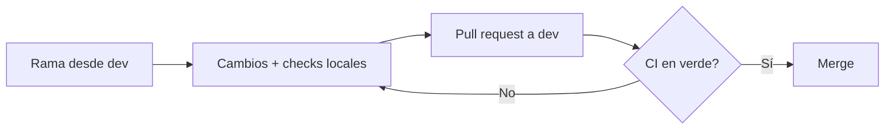

<div align="center">
  

  <br><br>

  <a href="https://en.cppreference.com/w/cpp/23"></a>
  <a href="https://xmake.io"></a>
  <a href="https://clang.llvm.org/"></a>
  <a href="https://github.com/CHOCEK-RB/kravidb/actions/workflows/ci.yml"></a>
  
  

  <br><br>

  <p><i>Un motor de base de datos desarrollado desde cero para el curso de Estructuras de Datos y Algoritmos.</i></p>

  <a href="#-sobre-el-proyecto">Sobre el proyecto</a> &nbsp;•&nbsp;
  <a href="#-inicio-rápido">Inicio rápido</a> &nbsp;•&nbsp;
  <a href="#-árbol-b-y-grado-t">Árbol B & Grado t</a> &nbsp;•&nbsp;
  <a href="#-visualizador-web-y-api">Visualizador & API</a> &nbsp;•&nbsp;
  <a href="#-pruebas-y-benchmarks">Pruebas & Benchmarks</a> &nbsp;•&nbsp;
  <a href="#-estructura">Estructura</a> &nbsp;•&nbsp;
  <a href="#-calidad-de-código">Calidad de código</a> &nbsp;•&nbsp;
  <a href="#-flujo-de-trabajo">Flujo de trabajo</a>
</div>

<br>

---

## 📖 Sobre el proyecto

**kravidb** es un motor de base de datos que se construye paso a paso, implementando desde adentro los componentes de una base de datos real: el **motor de almacenamiento**, el manejo de **páginas** en disco, la **indexación** y la ejecución de **consultas**.

El proyecto aprovecha lo más moderno de **C++23** —incluyendo **módulos** y la librería estándar importada con `import std;`— para lograr un código limpio, de compilación rápida y fácil de mantener.

<br>

## ✨ Características

<table>
  <tr>
    <td width="50%" valign="top">

  🧩 **Arquitectura modular**  
  Basada en módulos de C++23 (`.cppm`), sin cabeceras heredadas.

  💾 **Motor de almacenamiento**  
  Páginas ranuradas (*slotted pages*) de 4KB con buffer contiguo en memoria.

  🌳 **Índice Árbol B (CLRS)**  
  Búsqueda balanceada $O(\log n)$ y división proactiva en inserciones masivas.

  ⚡ **Compilación moderna**  
  Con [xmake](https://xmake.io): sin `Makefile` ni `CMake`.

   </td>
    <td width="50%" valign="top">

  🛡️ **Seguridad de memoria**  
  AddressSanitizer y UBSan activos en modo debug.

  🎯 **Calidad garantizada**  
  `clang-format`, `clang-tidy` y CI automático en cada commit.

  🔍 **Cero descuidos**  
  Los *warnings* se tratan como errores (`-Wall -Werror`).

  🖥️ **Visualizador interactivo**  
  Inspección en vivo del árbol B, métricas y volcado hexadecimal de páginas.

   </td>
  </tr>
</table>

<br>

## 🛠️ Stack tecnológico

| Herramienta | Versión | Propósito |
|:---|:---:|:---|
| **C++** | `23` | Lenguaje principal — módulos y `std` importado |
| **Clang** | `17+ / 22` | Compilador de desarrollo y CI |
| **xmake** | `2.8+` | Sistema de construcción |
| **clang-format** | `17+` | Formateo automático del código |
| **clang-tidy** | `17+` | Análisis estático |
| **GoogleTest** | `1.15+` | Suite de pruebas unitarias automatizadas |
| **Google Benchmark** | `1.8+` | Micro-benchmarking de operaciones de almacenamiento |
| **Bun** | `1.0+` | Bundler y entorno para el visualizador web |

<br>

## 🚀 Inicio rápido

> [!NOTE]
> Necesitas **clang++ 17+**, **xmake 2.8+**, **clang-format 17+** y **clang-tidy 17+** instalados.

```bash
# Clonar el repositorio
git clone https://github.com/CHOCEK-RB/kravidb.git
cd kravidb

# Compilar el proyecto
xmake

# Ejecutar el binario
xmake run kravidb
```

<div align="center">

**Salida esperada**

</div>

```console
Booting: Starting kravidb storage engine v0.1.0
StorageEngine initialized with 4096-byte pages and BTree degree 64.
```

<br>

## 🌳 Árbol B y Grado $t$

El índice implementa un Árbol B conforme a la especificación clásica de Cormen, Leiserson, Rivest y Stein (**CLRS**), parametrizado por su grado mínimo $t \ge 2$:

- Cada nodo interno contiene entre $t - 1$ y $2t - 1$ claves ordenadas, y entre $t$ y $2t$ punteros a hijos.
- **Grado por defecto ($t = 64$):**
  1. **Capacidad de nodo:** Almacena entre 63 y 127 claves de tipo `int64_t` y hasta 128 punteros por nodo.
  2. **Alineación y caché:** Un nodo de $t=64$ agrupa claves y punteros en bloques contiguos de memoria que aprovechan las líneas de caché de CPU (L1/L2/L3) y el tamaño típico de bloque de almacenamiento secundario.
  3. **Profundidad mínima del árbol:** Para un volumen masivo de $1\,000\,000$ de registros, la altura máxima del árbol no excede $h \le \lceil \log_{64}(10^6) \rceil \approx 3$. Esto garantiza que cualquier búsqueda por clave concluye en como máximo 3 saltos de nodo ($< 150 \text{ ns}$).
  4. **Grado dinámico en visualización:** Para propósitos educativos y de demostración gráfica, el servidor API y el visualizador permiten reconfigurar el grado dinámicamente entre $t = 2$ y $t = 128$.

<br>

## 🌐 Visualizador Web y API

`kravidb_api` expone el motor de almacenamiento mediante HTTP con [cpp-httplib](https://github.com/yhirose/cpp-httplib) y monta el visualizador web interactivo en Svelte para operar en un único puerto (**8080**):

```bash
# 1. Compilar los archivos estáticos del frontend (requiere Bun)
cd web && VITE_USE_MOCK=false bun run build && cd ..

# 2. Iniciar el servidor API y visualizador en un único origen
xmake run kravidb_api 8080
```
kravidb/
├── src/
│   ├── main.cpp              # Punto de entrada
│   └── storage/
│       └── engine.cppm       # Módulo del motor de almacenamiento
├── tests/                    # Pruebas (en construcción)
├── .github/workflows/
│   └── ci.yml                # Pipeline de integración continua
├── .githooks/
│   └── pre-commit            # Validación antes de cada commit
├── .clang-format             # Reglas de formateo
├── .clang-tidy               # Reglas de análisis estático
├── xmake.lua                 # Configuración de construcción
└── README.md
```

<br>

## ✅ Calidad de código

Todos los *pull requests* pasan por **GitHub Actions** (`.github/workflows/ci.yml`). Cada commit debe superar las verificaciones de **formato** y **compilación** antes de poder fusionarse.

> [!TIP]
> Activa el hook local **una sola vez** y cada `git commit` validará formato, compilación y análisis estático de forma automática:
> ```bash
> git config core.hooksPath .githooks
> ```

Abre [http://localhost:8080](http://localhost:8080) en el navegador para interactuar con el motor en tiempo real.

### Rutas principales de la API REST

| Método | Ruta | Descripción |
|:---|:---|:---|
| `GET` | `/api/v1/health` | Comprobación de estado del servicio |
| `GET` | `/api/v1/config` | Configuración actual (grado $t$, tamaño de página) |
| `POST` | `/api/v1/config` | Modifica el grado $t$ y reconstruye el árbol dinámicamente |
| `GET` | `/api/v1/btree` | Jerarquía completa de nodos y claves para renderizado |
| `POST` | `/api/v1/btree/insert` | Inserción de tupla: `{"key": 42, "payload": "..."}` |
| `GET` | `/api/v1/btree/search?key=42` | Traza del recorrido en el árbol e índices consultados |
| `GET` | `/api/v1/page/:id` | Volcado hexadecimal y directorio de ranuras de la página `:id` |
| `POST` | `/api/v1/reset` | Reinicia y re-siembra el motor de almacenamiento |

<br>

## 🧪 Pruebas y Benchmarks

### Pruebas automatizadas (GoogleTest)

La suite de pruebas contiene **55 casos automatizados** cubriendo desbordamiento de nodos, división de raíz, inserciones masivas ($10^4$ y $10^5$ claves), integridad de `RowID`, serialización de tuplas y validación de esquemas con AddressSanitizer y UndefinedBehaviorSanitizer:

```bash
# Ejecutar la suite completa de pruebas unitarias
xmake test

# Para ver el detalle paso a paso de cada caso
./build/linux/x86_64/debug/kravidb_tests
```

### Benchmarks (Index Scan vs Full Table Scan)

El arnés comparativo en [`benchmarks/benchmark.cpp`](file:///home/chocek/Codes/eda/TIF/kravidb/benchmarks/benchmark.cpp) evalúa el rendimiento sobre conjuntos sintéticos de datos ($N = 10^3 \dots 10^6$ registros):

```bash
# Reconfigurar en modo release (sin sanitizers que distorsionen la latencia)
xmake f -c -m release
xmake run benchmarks
```

**Resultado representativo ($N = 1\,000\,000$ registros):**
- **Index Scan (`Table::find_by_index`):** $\sim 132 \text{ ns/op}$ con $O(\log N)$ accesos a nodo.
- **Full Table Scan (`Table::scan_all`):** $\sim 5.2 \text{ ms/op}$ con $O(N)$ lecturas secuenciales de páginas.
- **Aceleración:** El índice B-Tree es aproximadamente **$40\,000 \times$ más rápido** que el escaneo completo de la tabla.

<br>

## 📂 Estructura

```
kravidb/
├── assets/                   # Recursos gráficos (banner, diagramas)
├── benchmarks/               # Arnés de rendimiento Google Benchmark
│   └── benchmark.cpp         # Comparativa Index Scan vs Full Table Scan
├── docs/                     # Documentación técnica generada
├── src/
│   ├── kravidb.cppm          # Preludio público exportador del motor
│   ├── main.cpp              # Punto de entrada de la aplicación
│   ├── api/                  # Servidor HTTP REST (cpp-httplib)
│   │   ├── json.{cpp,cppm}   # Serializador JSON ligero
│   │   ├── serialization.*   # Mapeo de estado del motor al contrato web
│   │   └── server.{cpp,cppm} # Rutas REST y montaje de activos estáticos
│   ├── index/                # Módulo de indexación B-Tree
│   │   ├── btree.{cpp,cppm}  # Lógica de inserción, split preventivo y búsqueda
│   │   ├── btree_node.cppm   # Definición de nodos internos y hojas
│   │   └── index.cppm        # Contrato abstracto Index
│   └── storage/              # Módulo de almacenamiento paged & slotted
│       ├── engine.{cpp,cppm} # Fachada StorageEngine unificadora
│       ├── page_manager.*    # Buffer contiguo de páginas de 4KB y ranuras
│       ├── record_store.cppm # Contrato abstracto RecordStore
│       ├── row_id.cppm       # Empaquetado uint64 de PageID y SlotID
│       ├── schema.cppm       # Definición de columnas y catálogo de tipos
│       ├── table.{cpp,cppm}  # Abstracción de tabla con validación de tuplas
│       └── tuple.cppm        # Serializador binario INT y VARCHAR
├── tests/                    # Suite de 55 pruebas unitarias con GoogleTest
├── web/                      # Visualizador interactivo en Svelte + Vite
├── .github/workflows/
│   └── ci.yml                # Pipeline de integración continua
├── .githooks/
│   └── pre-commit            # Validación antes de cada commit
├── .clang-format             # Reglas de formateo
├── .clang-tidy               # Reglas de análisis estático
├── xmake.lua                 # Configuración de construcción
└── README.md
```

<br>

## ✅ Calidad de código

Todos los *pull requests* pasan por **GitHub Actions** (`.github/workflows/ci.yml`). Cada commit debe superar las verificaciones de **formato** y **compilación** antes de poder fusionarse.

> [!TIP]
> Activa el hook local **una sola vez** y cada `git commit` validará formato, compilación y análisis estático de forma automática:
> ```bash
> git config core.hooksPath .githooks
> ```

<details>
<summary><b>🔧 Verificaciones manuales</b> — los mismos comandos que corre la CI</summary>

<br>

```bash
# 1. Formatear todos los archivos fuente automáticamente
find src tests -name "*.cpp" -o -name "*.cppm" | xargs clang-format -i

# 2. Verificar el formato (comprobación de CI)
find src tests -name "*.cpp" -o -name "*.cppm" | xargs clang-format --dry-run --Werror

# 3. Compilación limpia con AddressSanitizer / UBSan
xmake f -c -m debug
xmake
xmake run kravidb

# 4. Análisis estático con clang-tidy
find src -name "*.cpp" -o -name "*.cppm" | xargs clang-tidy -p .
```

</details>

<br>

## 🔄 Modos de compilación

| Modo | Comando | Características |
|:---|:---|:---|
| 🐞 **Debug** | `xmake f -m debug` | Símbolos de depuración · sin optimización · ASan + UBSan |
| 🚀 **Release** | `xmake f -m release` | Optimización máxima · símbolos ocultos |

```bash
# Cambiar a modo release y compilar
xmake f -c -m release
xmake
```

<br>

## 🌿 Flujo de trabajo

El proyecto trabaja sobre dos ramas principales, `main` y `dev`. La CI se dispara en cada *push* y *pull request* hacia ellas.



> [!IMPORTANT]
> Espera a que la CI pase en verde ✅ antes de fusionar cualquier *pull request*.

<br>

---

<div align="center">

**kravidb** · Proyecto del curso de EDA · equipo **CHOCEK-RB**

<sub>Hecho con 💙 y mucho C++</sub>

</div>
